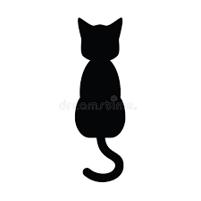

# ASCII-art
## Test
This repository was copied from [this fork](https://github.com/bvreede/ascii-art-forked-from-ckelyan), for teaching purposes.
The original code is by [@ckelyan](https://github.com/ckelyan) and is licensed under the [MIT license](https://github.com/ckelyan/ascii-art/blob/main/LICENSE).

## Use this script
This project can be run from the command line with

```
python imtascii.py
```

This will generate an ASCII version of the template image:



Namely:
```
(225, 224)


                                            @=                     @#
                                            @@@@=               @@@@@
                                            @@@@@@@@-+@@@@@=+@@@@@@@+
                                            +@@@@@@@@@@@@@@@@@@@@@@@
                                             @@@@@@@@@@@@@@@@@@@@@@@
                                             #@@@@@@@@@@@@@@@@@@@@@
                                              @@@@@@@@@@@@@@@@@@@@@
                                             .@@@@@@@@@@@@@@@@@@@@@
                                             :@@@@@@@@@@@@@@@@@@@@@
                                             :@@@@@@@@@@@@@@@@@@@@@
                                              @@@@@@@@@@@@@@@@@@@@=
                                                @@@@@@@@@@@@@@@@*
                                                  @@@@@@@@@@@@:
                                                 @@@@@@@@@@@@@@@
                                               :@@@@@@@@@@@@@@@@@
                                               @@@@@@@@@@@@@@@@@@@
                                              @@@@@@@@@@@@@@@@@@@@=
                                             :@@@@@@@@@@@@@@@@@@@@@
                                             @@@@@@@@@@@@@@@@@@@@@@:
                                             @@@@@@@@@@@@@@@@@@@@@@*
                                             @@@@@@@@@@@@@@@@@@@@@@@
                                             @@@@@@@@@@@@@@@@@@@@@@@
                                             @@@@@@@@@@@@@@@@@%@%%@#
                                            @@@@@@@@@@@@@@@@@@@#%@@@@
                                           @@%%%%@%%%%%@%%@%%%@%%%%%%-
                                          .%@%%@%%%@%@%%@@@%@@@%%%%%%@
                                          #@@@@@@@@@@@@@@@@@@@@@@@@@@@
                                          @@@@@@@@@@@@@@@@@@@@@@@@@@@@:
                                          @@@@@@@@@@@@@@@@@@@@@@@@@@@@:
                                          +@@@@@@@@@@@@@@@@@@@@@@@@@@@
                                           @@@@@@@@@@@@@@@@@@@@@@@@@@#
                                            @@@@@@@@@@@@@@@@@@@@@@@@@
                                             %@@@@@@@@@@@@@@@@@@@@@.
                                                @@@@@@@@@@@@@@@@*
                                                      =@@@@
                                                       @@@@@
                                                       -@@@@@
                                                        .@@@@@@*
                                                          *@@@@@@@*
                                                             @@@@@@@-
                                                                @@@@@
                                                                 @@@@:
                                               @@@#             @@@@@
                                              -@@@@@@@=      *@@@@@@-
                                                @@@@@@@@@@@@@@@@@@@
                                                   +@@@@@@@@@@@*


Total characters: 6328
Time to execute: 0.005139827728271484
x: 112 | y: 56
```
